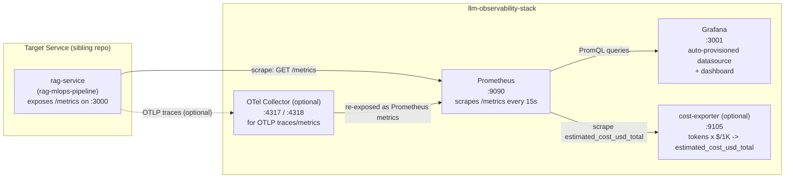

# llm-observability-stack

A Prometheus + Grafana observability stack purpose-built for monitoring LLM and RAG
services — request rate, tail latency, error rate, retrieval quality, token
throughput, and estimated cost, all pre-wired into a dashboard that's live the moment
you run `docker compose up`. No manual "add a datasource" or "import a dashboard"
step.

This is standard production monitoring practice (Prometheus scrape → Grafana
dashboard, the same pattern used for any HTTP service) re-pointed at the metrics that
actually matter for an LLM/RAG service instead of a generic web app.

## Why observability for LLM/agent systems isn't optional

Traditional service monitoring answers "is it up and is it fast." LLM and RAG systems
need that too, but they fail in ways a plain uptime/latency dashboard won't catch:
retrieval can silently degrade while the service stays "healthy" (200s, normal
latency, an index that's quietly gone stale), token usage can spike from a prompt or
model change and turn into a cost incident with zero infrastructure symptoms, and
tail latency matters more than average latency because a single slow generation can
dominate a user's experience of the whole system. None of that shows up in a
generic "requests per second" panel.

By 2026, most teams shipping LLM-backed products treat this as part of the system's
design, not something bolted on after an incident: you instrument retrieval quality
and token economics alongside the usual golden signals (traffic, errors, latency,
saturation) from day one, because "the model responded" and "the model responded
*well, cheaply, and within budget*" are different claims and only one of them shows
up if you only watch uptime. This repo is that instrumentation layer — the
observability side of an AI infrastructure stack, built with the same
Prometheus/Grafana toolchain used for conventional production monitoring.

## Architecture



- **Prometheus** pulls metrics from the target service on a 15s interval (config in
  [`prometheus/prometheus.yml`](prometheus/prometheus.yml)).
- **Grafana** reads from Prometheus and renders the pre-provisioned **LLM Overview**
  dashboard — the datasource and dashboard are both loaded from files at container
  start, not clicked through in the UI (see
  [`grafana/provisioning/`](grafana/provisioning/)).
- **OTel Collector** is optional and off by default. It exists for services that emit
  OTLP traces/metrics instead of a scrapeable `/metrics` endpoint — the collector
  ingests OTLP and re-exposes metrics in Prometheus format so they flow into the same
  dashboard. Traces themselves aren't wired to a trace backend in this repo (no
  Tempo/Jaeger included, to keep the stack focused); the collector config
  ([`otel-collector/otel-collector-config.yml`](otel-collector/otel-collector-config.yml))
  logs received spans via a debug exporter so you can confirm the pipeline works, and
  documents where to plug in a real trace backend.
- **cost-exporter** is optional and off by default. See "On the cost panel" below for
  why it's a separate tiny service rather than a Grafana-native calculation.

## Quickstart

```bash
git clone <this-repo>
cd llm-observability-stack
docker compose up -d
```

Then open **http://localhost:3001** (Grafana). Log in with `admin` / `admin` — you'll
be prompted to change it; do that before this ever runs anywhere reachable outside
your laptop.

The **LLM Overview** dashboard is already there, under the "LLM Observability" folder,
fully wired to the Prometheus datasource. Nothing to add, nothing to import.

Prometheus itself is reachable at **http://localhost:9090** if you want to run raw
PromQL queries or check scrape target health at
`http://localhost:9090/targets`.

By default Prometheus is scraping `rag-service:3000/metrics`, which won't exist
unless something on the same Docker network is serving it (e.g. the companion
[`rag-mlops-pipeline`](#related-projects) repo). That's expected — the dashboard will
just show "No data" until a target is scraping successfully. Check
`http://localhost:9090/targets` to confirm what Prometheus can currently reach.

### Optional pieces

```bash
# OTel Collector, for services emitting OTLP instead of a /metrics endpoint
docker compose --profile otel up -d

# Cost exporter, for the "Estimated Cost" panels
docker compose --profile cost up -d
```

## Screenshots

_Add screenshots here after running `docker compose up -d` locally — e.g. the LLM
Overview dashboard at `localhost:3001`, and the Prometheus targets page at
`localhost:9090/targets` showing a healthy scrape._

## Pointing this at a different service

The stack ships targeting `rag-service:3000` (the sibling `rag-mlops-pipeline`
repo's container name/port on the shared Docker network), but nothing about it is
hardcoded to only work with that one service. To point it elsewhere:

1. **Quick edit** — change the target in
   [`prometheus/prometheus.yml`](prometheus/prometheus.yml) under the `rag-service`
   job's `static_configs.targets` to your container's `<name>:<port>` (must be
   reachable on the `llm-observability` Docker network — see `docker-compose.yml`),
   or a `host:port` if it's running outside Docker (`host.docker.internal:<port>` on
   Docker Desktop).
2. **Different metrics path** — add a `metrics_path:` line to the job if it's not
   `/metrics`.
3. **Multiple/rotating targets without editing this file each time** — switch the job
   to `file_sd_configs` pointed at a directory of target JSON files, so you can
   add/remove scrape targets by dropping files in rather than restarting Prometheus.
   The exact block is documented inline in `prometheus/prometheus.yml`.
4. **Different metric names entirely** — the panels in
   `grafana/dashboards/llm-overview.json` query four metric names
   (`rag_requests_total`, `rag_request_latency_seconds`, `rag_retrieval_score`,
   `rag_tokens_generated_total`). These are a *convention*, not a protocol — if your
   service names its metrics differently, edit the `expr` field of each panel's
   `targets` entry in that JSON file to match. The panel layout, thresholds, and
   descriptions are still useful as a template even if you rename everything.

## Expected metric conventions

This dashboard is built against the instrumentation convention used by the companion
`rag-mlops-pipeline` repo. If you're instrumenting your own service to match:

| Metric | Type | Labels | Used for |
|---|---|---|---|
| `rag_requests_total` | Counter | `status` (e.g. `ok`, `error`, `timeout`) | Request rate, error rate % |
| `rag_request_latency_seconds` | Histogram | — | p50/p95/p99 latency via `histogram_quantile` |
| `rag_retrieval_score` | Gauge (or Histogram) | — | Retrieval quality over time |
| `rag_tokens_generated_total` | Counter | — | Token throughput, input to estimated cost |

`rag_request_latency_seconds` must be a real Prometheus **histogram** (i.e. your
client library needs to expose `rag_request_latency_seconds_bucket` with `le`
labels) — `histogram_quantile` doesn't work against a plain gauge or summary.

## Panel-by-panel: what each one tells an on-call engineer

- **Request Rate (by status)** — the basic "is traffic flowing, and is it flowing
  successfully" signal, split by status so a spike in `error` is visible as a shape
  change, not just a number buried in a total.
- **Error Rate %** — non-`ok` requests as a *percentage* of total, not a raw count. A
  raw error count is meaningless without knowing the traffic volume it happened
  against; percentage is what you'd actually set an alert threshold on.
- **Request Latency (p50/p95/p99)** — percentiles, not the average. The mean hides
  the tail: a service can have an excellent average latency while its slowest 1% of
  requests — the ones hitting cold caches, long generations, or retrieval fallbacks —
  are what actually breach SLOs and page people. p99 is tracked with a heavier line
  weight in the dashboard specifically so it doesn't get visually lost under p50.
- **Retrieval Quality Over Time** — a leading indicator, not a lagging one. Retrieval
  score can degrade (stale index, embedding drift, a source corpus that silently
  stopped updating) well before users complain or an eval suite catches it. This is
  the panel that's specific to RAG systems and wouldn't exist on a generic service
  dashboard.
- **Token Throughput** — both a capacity signal and the direct input to cost. A spike
  here without a matching request-rate spike usually means responses got longer (a
  prompt change, a model swap, a runaway generation loop) rather than more users
  showing up.
- **Estimated Cost / Cost Rate** — see below.
- **Total Requests** — a coarse sanity gauge, mostly useful for confirming the other
  panels are actually being fed live data rather than staring at an empty dashboard
  wondering if something's broken.

## On the cost panel (being straight about a real limitation)

The brief for this project asked for an "estimated cost" panel computed as
`tokens * $COST_PER_1K_TOKENS / 1000`, ideally as a native Grafana calculation.

Being direct about why that's not what's shipped: **PromQL and Grafana transforms
can't reach an arbitrary environment variable at query time and multiply it against a
live counter in a way that's reusable across panels.** You *can* hardcode a dollar
figure directly into a PromQL expression (e.g.
`sum(rate(rag_tokens_generated_total[5m])) * 0.00001`), but then the price is buried
inside dashboard JSON — invisible, and you have to hunt down and edit every panel
that references it whenever pricing changes. That's worse than an explicit
extension point, not better, so this repo doesn't fake it that way.

Instead, [`exporter/cost_exporter.py`](exporter/cost_exporter.py) is a small
(~150-line, stdlib-only) companion Prometheus exporter: it polls Prometheus for the
current `rag_tokens_generated_total`, multiplies by `COST_PER_1K_TOKENS / 1000`, and
re-exposes the result as its own metric, `estimated_cost_usd_total`, which Prometheus
then scrapes like any other target. The dashboard's cost panels just read that
metric — no pricing math lives inside dashboard JSON, and the $/1K rate lives in
exactly one place (an env var), not scattered across panels.

If you don't run the exporter (`docker compose --profile cost up -d`), the cost
panels correctly show "No data" instead of a silently wrong number — that's
intentional.

## What's in this repo

```
llm-observability-stack/
├── docker-compose.yml                          # prometheus, grafana, optional otel-collector, optional cost-exporter
├── prometheus/
│   └── prometheus.yml                          # scrape config (rag-service + self + optional targets)
├── grafana/
│   ├── provisioning/
│   │   ├── datasources/prometheus.yml          # auto-provisioned Prometheus datasource
│   │   └── dashboards/dashboard.yml            # tells Grafana to load dashboards/ from disk
│   └── dashboards/
│       └── llm-overview.json                   # the dashboard itself
├── otel-collector/
│   └── otel-collector-config.yml               # optional OTLP -> Prometheus bridge
├── exporter/
│   ├── cost_exporter.py                        # companion cost-estimation exporter
│   └── Dockerfile
├── LICENSE
└── .gitignore
```

## Validation notes

This was built with Docker available, so it was validated by actually running it, not
just by reading the config:

- **`docker compose config`** (both without profiles, and with `--profile otel
  --profile cost`) parses `docker-compose.yml` cleanly with no errors.
- **`docker compose up -d prometheus grafana`** was run for real: Prometheus reached
  `healthy` on its healthcheck, and Grafana came up behind `depends_on:
  condition: service_healthy` as configured.
- **Auto-provisioning was confirmed via Grafana's API**, not assumed:
  `GET /api/datasources` showed the Prometheus datasource already present
  (`uid: prometheus`, pointed at `http://prometheus:9090`) with zero manual setup, and
  `GET /api/dashboards/uid/llm-overview` returned the dashboard with **all 12 panels
  loaded** (3 row panels + 9 data panels) — confirming the JSON is schema-valid and
  Grafana didn't silently drop any panel.
- **`docker compose --profile otel --profile cost up -d`** was also run: the
  `cost-exporter` image built and started, and its `/metrics` endpoint served real
  Prometheus-format output (`cost_exporter_up 1`, confirming it successfully queried
  Prometheus); the `otel-collector` started cleanly with no errors in its logs.
- **Prometheus's own `/api/v1/targets`** was checked after bringing everything up:
  `prometheus`, `otel-collector`, and `cost-exporter` targets all reported `up`;
  `rag-service` correctly reported `down`, since no sibling service exists in this
  environment — that's the expected, documented state, not a bug.
- Everything was torn down afterward (`docker compose down -v`) and test images
  removed; no containers, volumes, or images from this validation were left running.
- `cost_exporter.py` was also compile-checked with `py_compile` independent of the
  container run.

**What still needs a real `rag-service` to see live**: with no metrics-emitting
service on the network, every panel currently renders "No data" — that's correct
behavior, not a defect, but you won't see populated graphs until you point this at an
actual instrumented service (see "Pointing this at a different service" above).

## Related projects

Part of a small AI-infrastructure project set:

- **[rag-mlops-pipeline](#)** — the RAG service this stack targets by default
- **[ai-agent-guardrails](#)** — guardrails/safety layer for agentic systems
- **[ai-infra-terraform](#)** — infrastructure-as-code for the above

## License

MIT — see [LICENSE](LICENSE).
